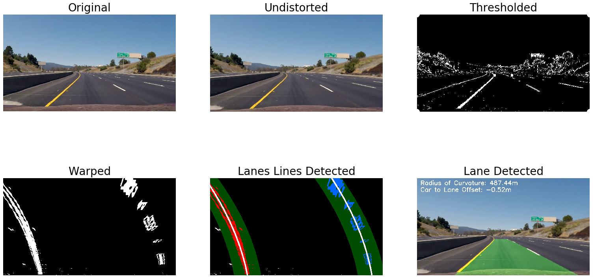

# Advanced Lane Finding


## Setup

Install the project dependencies.

```bash
$ pipenv install
```

Spawn a shell in the pipenv virtual environment. This will give you access to all of the
dependencies installed above.

```bash
$ pipenv shell
```

## Run

Run the lane finder from the pipenv shell you spawned above.

```bash
python src/lane_finder.py
```

## Writeup

The goals / steps of this project are the following:

* Compute the camera calibration matrix and distortion coefficients given a set of chessboard images.
* Apply a distortion correction to raw images.
* Use color transforms, gradients, etc., to create a thresholded binary image.
* Apply a perspective transform to rectify binary image ("birds-eye view").
* Detect lane pixels and fit to find the lane boundary.
* Determine the curvature of the lane and vehicle position with respect to center.
* Warp the detected lane boundaries back onto the original image.
* Output visual display of the lane boundaries and numerical estimation of lane curvature and vehicle position.

### Writeup / README

#### 1. Provide a Writeup / README that includes all the rubric points and how you addressed each one.

This document is my README!

### Camera Calibration

#### 1. Briefly state how you computed the camera matrix and distortion coefficients. Provide an example of a distortion corrected calibration image.

For code, see `calculate_calibration()` in `src/camera_calibrator.py`.

A series of images of checkerboards are read in from `camera_calibration/input_images`. A mapping
from checkerboard intersection indices to checkerboard intersection coordinates in the image is used
to create a pixel mapping that dictates the transformation that needs to take place to undistort any
arbitrary image that is taken on this camera. I cached the camera calibration parameters in
`camera_calibration/camera_calibration.json` so that it wouldn't have to be regenerated each time
`src/lane_detector.py` is run.

### Pipeline (single images)



#### 1. Provide an example of a distortion-corrected image.

For code, see `undistort()` in `src/lane_finder.py`.

For visual, see the second image, titled "Undistorted", in the figure above.


#### 2. Describe how (and identify where in your code) you used color transforms, gradients or other methods to create a thresholded binary image.  Provide an example of a binary image result.

For code see `threshold()` in `src/lane_finder.py`.

For visual, see the third image, titled "Thresholded", in the figure above.

I used a combination of HLS color channel thresholds and gradient thresholds to generate a binary image. This binary image highlights important features, including the lane lines, which will be used to detect the lane in future steps.

#### 3. Describe how (and identify where in your code) you performed a perspective transform and provide an example of a transformed image.

For code, see `warp()` in `src/lane_finder.py`.

For visual, see the fourth image, titled "Warped", in the figure above.

To create the perspective warp, I used OpenCV tools that transform an image such that four
specified source points align with four specified destination points. The source points drew the
outline of the road and the destination points draw the outline of the entire image.


#### 4. Describe how (and identify where in your code) you identified lane-line pixels and fit their positions with a polynomial?

For code, see `get_poly_coeffs_from_img_bin()` and
`get_poly_coeffs_from_img_bin_and_prev_poly_coeffs()` in `src/lane_finder.py`.

For visual, see the fifth image, titled "Lane Lines Detected", in the figure above.

#### 5. Describe how (and identify where in your code) you calculated the radius of curvature of the lane and the position of the vehicle with respect to center.

For code, see `get_curvature_radii_from_poly_coeffs()` in `src/lane_finder.py`.

#### 6. Provide an example image of your result plotted back down onto the road such that the lane area is identified clearly.

For code, see `draw_lane()` in `src/lane_finder.py`.

For visual, see the sixth image, titled "Lane Detected", in the figure above or see any images in
`media/test_output_images/` or any videos in `media/test_output_videos/`.

---

### Pipeline (video)

#### 1. Provide a link to your final video output.  Your pipeline should perform reasonably well on the entire project video (wobbly lines are ok but no catastrophic failures that would cause the car to drive off the road!).

[Here](media/test_output_videos/project_video.avi) is a video of the final output of a lane
detection.

### Discussion

#### 1. Briefly discuss any problems / issues you faced in your implementation of this project.  Where will your pipeline likely fail?  What could you do to make it more robust?

To improve my lane detection, I could:

* modify my sliding window lane detection method to use convolution.
* clean up my code a bit by implementing a Line class to keep track of the relevant
  information about the left and right lane line detections through each frame of the video.
* further tune my thresholding to better detect lane lines when road color changes and
  shadows stretch across the road.
